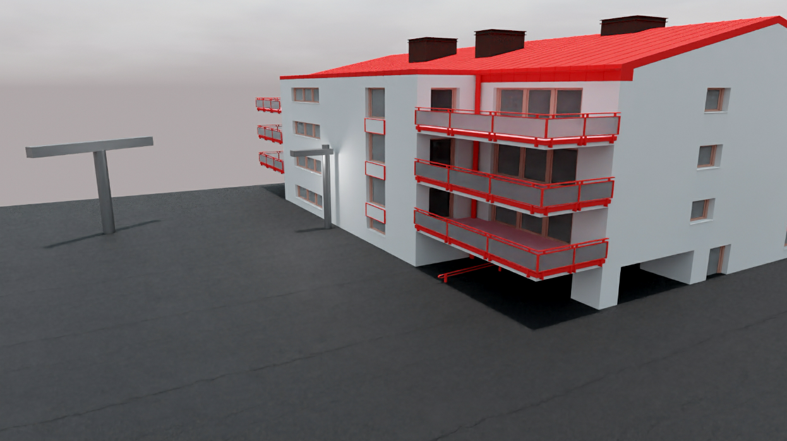
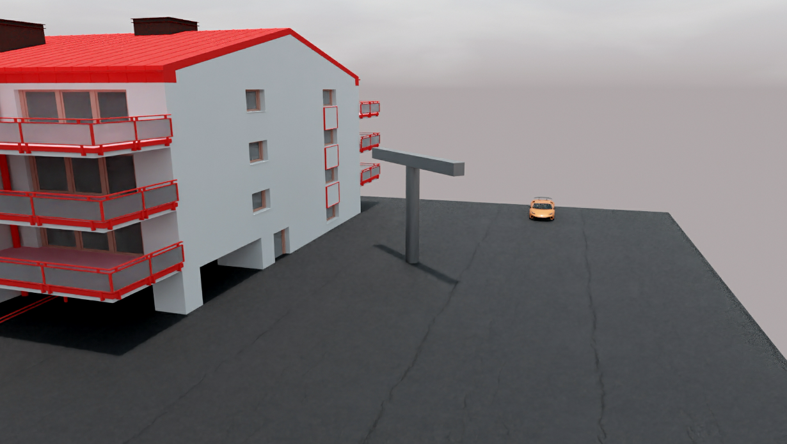
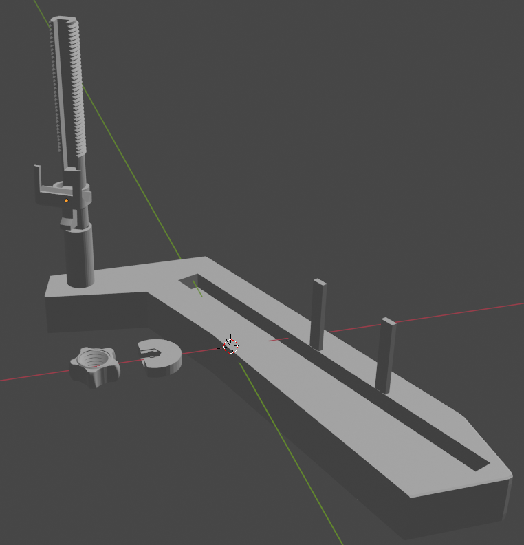

# Video integration to improve the field of view
The idea is to enlarge the field of view of two videos taken by the two cameras (the must be the same model).

**Note:** The two cameras have, ideally, 0 vertical and horizontal displacement, they differ only by a rotational component.

Naturally, this cannot be achieved. For this purpose, we have designed a base with a 3d printer, that allows as to minimize the horizontal and vertical displacement.
## Idea
Left video           |  Right video
:-------------------------:|:-------------------------:
  |  

**Result**


**Base**


## Features
* Automatic video alignment (see ```utils/syncstart```)

## Environment
* ```Python 3.10.0```
* Packages: see ```requirements.txt```

**Note:** ```utils/syncstart``` belongs to [this repo](https://github.com/rpuntaie/syncstart)
