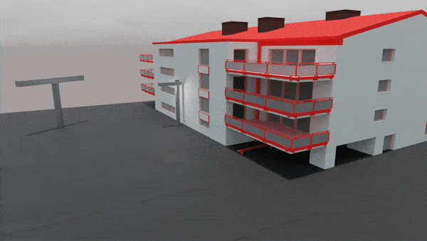
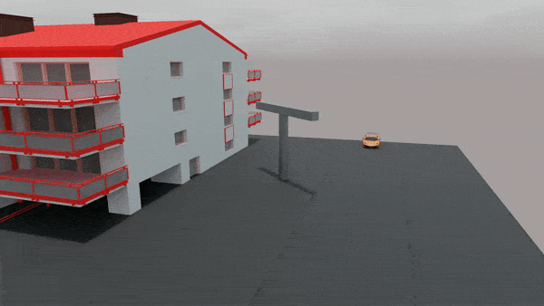
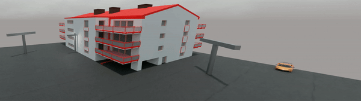
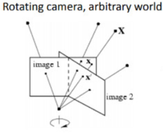
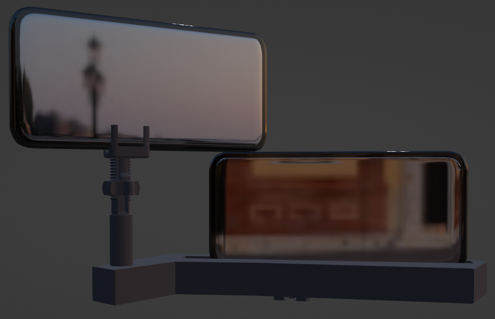
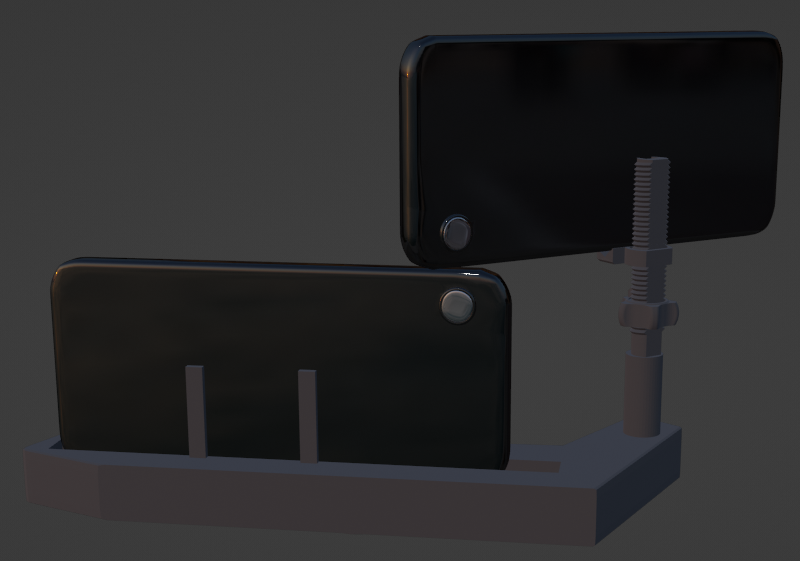
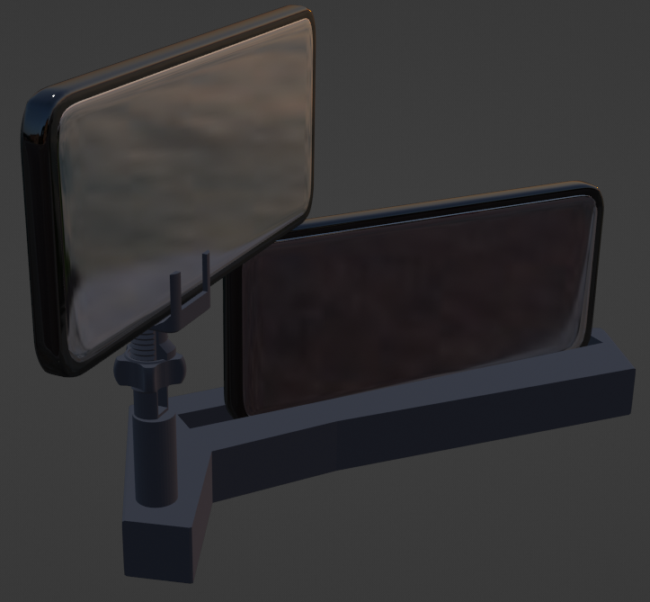
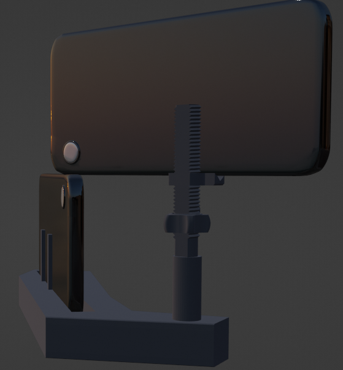

# Video integration to improve the field of view
The idea is to enlarge the field of view of two videos taken by the two cameras (the must be the same model).

**Note:** The two cameras have, ideally, 0 vertical and horizontal displacement, they differ only by a rotational component.

Naturally, this cannot be achieved. For this purpose, we have designed a base with a 3d printer, that allows as to minimize the horizontal and vertical displacement.
## Idea
Left video           |  Right video
:-------------------------:|:-------------------------:
  |  

**Result**




Ideally           |  Our setup
:-------------------------:|:-------------------------:
  |  

**How to use our 3d base with the same model of phone**

In the picture below, you can find how to use our 3d base with the same model of phone. As you can see, 
with this configuration, we can minimize the distance between the two cameras. This setup allows us to be 
really close from the ideal one.

Front           |               Back                
:-------------------------:|:--------------------------------------:
  |  
 |    


## Features
* Automatic video alignment (see ```utils/syncstart```)
* Video merging through homography
* Automatic homography calculator

## Environment
* ```Python 3.10.0```
* Packages: see ```requirements.txt```

**Note:** ```utils/syncstart``` belongs to [this repo](https://github.com/rpuntaie/syncstart)
